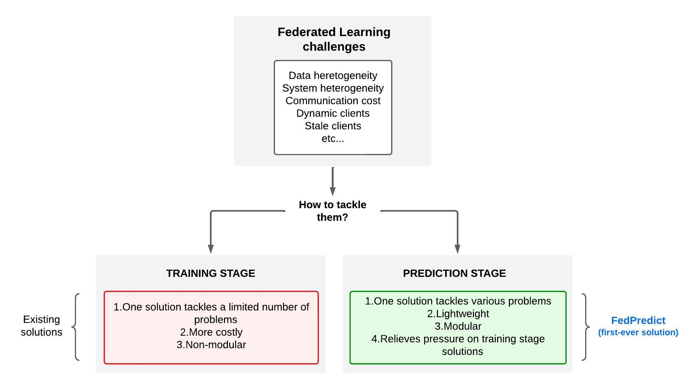
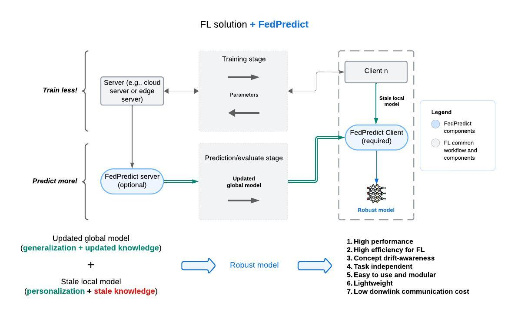

# Welcome to FedPredict
## The first-ever Federated Learning plugin!

FedPredict is a Federated Learning (FL) plugin that can significantly improve FL solutions without requiring additional training or expensive processing. 
FedPredict enables personalization for traditional methods, such as FedAvg and FedYogi. 
It is also a modular plugin that operates in the prediction stage of FL without requiring any modification in the training step. 
This project has been developed in the laboratories WISEMAP (UFMG), H.IAAC (UNICAMP), and NESPED (UFV).

The list of projects that use FedPredict is the following (updating):

- [FL-H.IAAC](https://github.com/AllanMSouza/FL-H.IAAC): it has the code of the experiments of FedPredict papers in **IEEE DCOSS-IoT [2023](https://ieeexplore.ieee.org/document/10257293) and 2024 (i.e., FedPredict and FedPredict-Dynamic**).
- PFLib (will be available soon).
- PyFlexe (will be available soon).

## Documentation

Please access the FedPredict [documentation](https://claudiocapanema.github.io/fedpredict/) for tutorials and API details.

## Why FedPredict?

It is better working with the **prediction stage**. See the comparison below!



## How it works?

FedPredict intelligently combines global and local model parameters. In this process,
it assigns more or less weight to each type of parameter according to various factors, such as 
the evolution level (el) of the global model, the update level (ul) of the local model, and the 
similarity (s) between the old data (i.e., the one in which the model was previously trained) and 
the recently acquired data). Then, the client uses the combined model to make predictions over the test/val data.



## Benefits

The list of benefits of the plugin as listed as follows:

1. **High performance**: achieve high performance in heterogeneous data.
2. **High efficiency for FL**: achieve high performance even when training less.
3. **Concept drift-awareness**: FedPredict makes the model almost instantly adapt to the new scenario when concept drift occurs.
4. **Task independent**: apply FedPredict for any type of deep neural network task.
5. **Easy to use and modular**: no modifications are necessary in the training stage of your solution!
6. **Lightweight**: it is composed of simple operations.
7. **Low downlink communication cost**: FedPredict server compresses global model parameters.

Just plug and play!

## Installation

FedPredict is compatible with Python>=3.8 and is tested on the latest versions of Ubuntu.
With your virtual environment opened, if you are using **Torch** type the following command to install FedPredict from Pypi:

```python
    pip install fedpredict[torch]
```

If you are using **Flower** for FL simulation, type:

```python
    pip install fedpredict[flwr]
```

## FL requirements

In general, if your solution shares some level of similarity with FedAvg, then FedPredict is ready to use.
The requirements are described as follows:

| Requirement | Description                                                                                                                                                        |
| :- |:-------------------------------------------------------------------------------------------------------------------------------------------------------------------|
| Sharing all layers | The clients have to upload all model layers at every round so the server can aggregate a global model that can be directly leveraged by a new client, as in FedAvg |
| Same model structure | The layers of the global and local models have to have the same shape to allow the combination of parameters                                                       |
| Predicting using the combined model | On the client side, the original method has to be flexible enough to make predictions based on the combined model; otherwise, the plugin will have no effect       |

## Components

Our solution has two main components: FedPredict client and FedPredict server. Their objectives are described below:

| Components        | Objective                                                                                                           | 
|:------------------|:--------------------------------------------------------------------------------------------------------------------|
| FedPredict Client | Transfer the knowledge from the updated global model to the client's stale local model                              |
| FedPredict server | Compresses the updated global model parameters to further send to the clients. Used together with FedPredict client |

### Citing

If FedPredict has been useful to you, please cite our [paper](https://ieeexplore.ieee.org/abstract/document/10257293). The BibTeX is presented as follows:

```
@inproceedings{capanema2023fedpredict,
  title={FedPredict: Combining Global and Local Parameters in the Prediction Step of Federated Learning},
  author={Capanema, Cl{\'a}udio GS and de Souza, Allan M and Silva, Fabr{\'\i}cio A and Villas, Leandro A and Loureiro, Antonio AF},
  booktitle={2023 19th International Conference on Distributed Computing in Smart Systems and the Internet of Things (DCOSS-IoT)},
  pages={17--24},
  year={2023},
  doi={https://doi.org/10.1109/DCOSS-IoT58021.2023.00012},
  organization={IEEE}
}
```